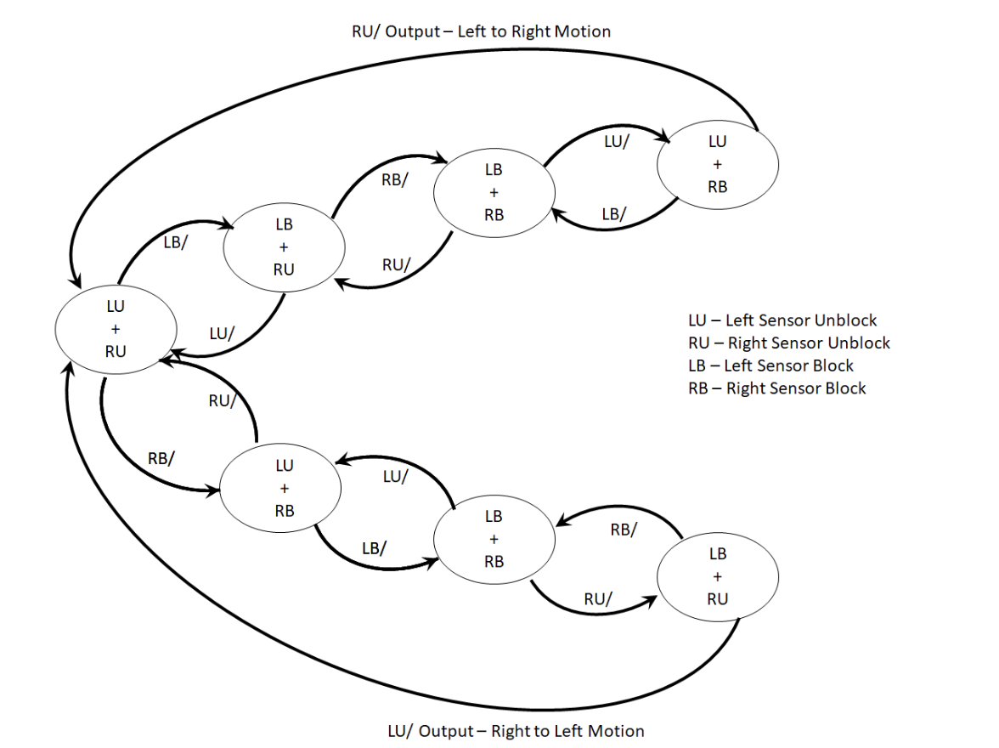
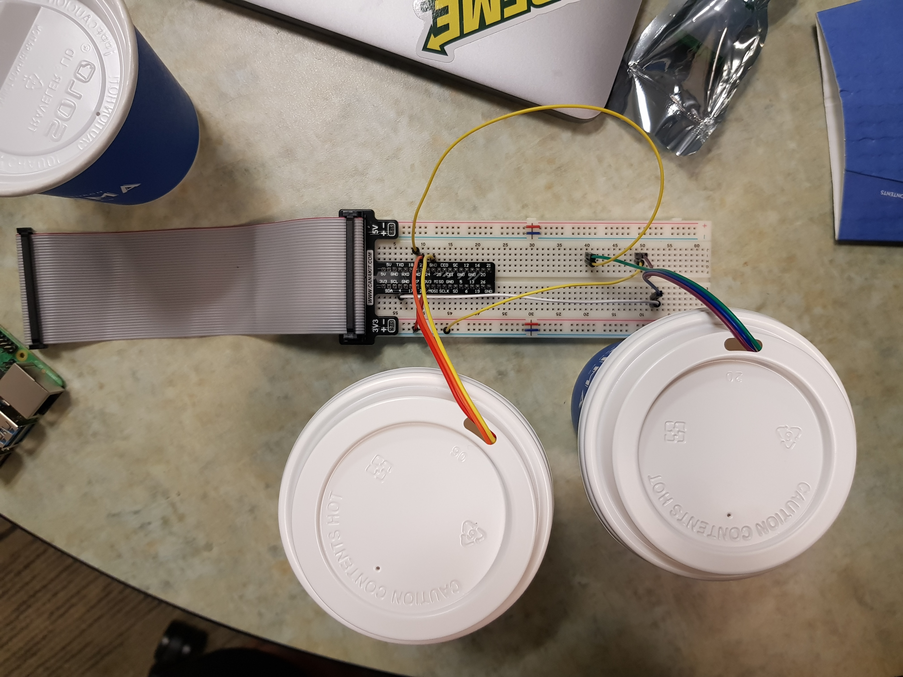

## Project Progress Report
 
## 1. Current Progress

### 1-1: Possible Project Ideas

As it was presented at Team AD’s project proposal presentation, Team AD has decided to create a hand-based control. Team AD thought that a hand-based control is either a hand-gesture based control, a hand-motion based control, or a hand-orientation based control. Hand-gesture based control is going to control the system by detecting the change in the shape of the hand/finger. Hand-motion based control is going to control the system by detecting the presence of the hand. Finally, a hand orientation based control is going to detect the movement of the hand to control the system. For the project, Team AD is going to create hand-based control to control the presentation slides. 

### 1-2: Research on the Specifications of Sensors

In order to successfully fulfill the objective of creating the hand-based control, Team AD thought of several sensors that can be potentially used. Team AD thought Photosensitive Light Sensor (LM393),  Infrared Motion Sensor (Hc Sr501), and Accelerometer  (MPU-6050) as the potential sensors for the project. Below shows the specification of each sensor. 

Photosensitive Light Sensor (LM393) 

-Sensing the Light Intensity Binary Output (“HIGH” or “LOW”) 

-Adjustable Sensitivity 

Infrared Motion Sensor (Hc Sr501) 

-Sensing the Temperature Binary Output (“Motion Detected” or “No Motion Detected”) 

-Range: 3m - 7m 

Accelerometer (MPU-6050) 

-Three-axis gyroscope + hree-axis accelerometer 

-Three Output (X- Y- Z-) for each output 

### 1-3: Programming Languages

For the project, it is important to create a programming code that can control the sensors, collect the data, and use the data to perform appropriate tasks. Therefore, it was important for the members to learn about the programming languages outside the class. The programming languages learned by the members are python and Matlab codes. Team AD has used and will use python and Matlab for signal collection and visualization. 

### 1-4: Experiments on Sensors
 
Team AD thought that it is very important to test the sensors in order to decide between hand-motion based control, hand-gesture based control, and hand-orientation based control for the project. Since Team AD had only infrared motion sensors and photosensitive light sensors, Team AD decided to test only infrared motion sensors and photosensitive light sensors. Team AD had two motion sensors and two light sensors to test. Team AD created several codes to test which sensors combination can be used to detect the motion/presence of the hand. Before the experiments, Team AD explored related videos to conceptualize the idea in order to conduct experiments and to write the code. Some of the codes are written in the Appendix. Team AD thought of three different combinations of the sensors: 1) light sensors and light sensors, 2) light sensors and motion sensors, and 3) motion sensors and motion sensors. Figure A-1 is the picture of the circuit showing that Team AD tested the sensors. 
 
From the experiment, Team AD has learned several things regarding the sensors. The ambient light is important for the light sensor to perform what Team AD wanted. Team AD had to adjust the ambient light and move hand very close to the sensor. To reduce the influence of other light changes around, Team AD put the light sensor into the box. Team AD also adjusted the speed of the hand motion to find the best collecting rate. As a result, the movement (left to right/right to left) of the hand was successfully detected with two light sensors. 
 
The motion sensor provides a binary output (No Motion/Motion Detected) and has a huge operating range. With code #2 shown in the Appendix, the movement (left to right/right to left) of the hand was not detected when Team AD tested second and third sensors combinations. 
 
### 1-5: Main project idea 
 
After testing the sensors, Team AD decided to create the hand-motion based control with the use of light sensors only. 


 
## 2. Problems Encountered
 
### 2-1: Solving the issue of the operational range of two sensors 
The angle of operation and the distance until which the sensor will provide output will have to be specified. But two different sensors have a different range of inputs, hence the integration of both is a difficulty. For infrared sensors, the operational range seems to be up til 7m, which is very large for our purpose. This will mean that even at 7m, the sensor would provide an output irrespective of the intention of the user.
 
### 2-2: Time required for initializing the sensors
The sensors take a certain period of time to initialize and adapt to the environment around them. This time is different for both , infrared motion sensor and photosensitive sensors.It will be difficult to define the initial time when the user can start giving instructions for gesture control.
 
### 2-3: Simulating complex state conditions 
The code has been defined for 2 sensors, for now, to describe if the user moves his hand from one direction to another. But when we use more than 2 sensors, complex state conditions arise. The binary output for four points need to be defined, S1, S2, S3, and S4 as well as for motion sensors. Hence, we plan to use State Machine for further progress of this project to easily define user input for different states.
  
### 2-4: Light sensor’s individual operational range 
The distance for which light sensors can detect the change in intensity of light is very small. The user can only input an instruction if he places his hand in the proximity of the sensor. This adds to the difficulty of controlling the screen because it decreases the user-friendliness of the equipment.
 
### 2-5: Time window between inputs
The motion sensor has a time sleep of 1 second. The difference of input between two motion sensors is small but displaying output takes approximately 2 seconds. The difference between states 1 and states 2 for the two sensors is detected with a time lag.
 
### 2-6: Light Sensor’s Initialisation 
The initial state that the light sensor was adjusting to was lighted. So every time the user slid the hand above it, the output did not change substantially. We tried covering the light sensors with closed circular objects to subtract the background noises and disturbances. The problem was temporarily solved but we will be creating a similar kit for the final project. 
  
## 3. Future Plan
There are four main things that we aim to do within a couple of weeks. 
Firstly, we need to start working on developing the code in Python after identifying the necessary library functions associated with the senors. 
Secondly, we need to develop an algorithm that could condition the output (data acquired from the sensors) by filtering out the noise and provide a quantified instruction to be used as a command to control the presentation slides. We also plan to implement a Finite State Machine with a flow shown in Figure 1.
Thirdly, we need to simultaneously work on the hardware and develop a proper set-up incorporating all the sensors, wires, mount, and the Raspberry pi. We would ensure that the influence of electric, magnetic or any other ambient noise is minimized. Additionally, we will finalize the detailed arrangement of sensors, for example, the distance to detect stimuli, sampling rate, a threshold of simulation etc.
Fourthly, we need to develop a GUI that could provide a seamless interaction between the user and the powerpoint slides. We are planning to use the filtered data and pass it on to the command prompt to alter the slides. Additionally, we will develop our knowledge about the Python programming language, Linux OS, and VIM text editor during the process of implementing these objectives.

 
Figure 1: Finite State Machine.


## Appendix A:Source Code

```markdown
Code #1: 
import busio
import digitalio
import board
import adafruit_mcp3xxx.mcp3008 as MCP
from adafruit_mcp3xxx.analog_in import AnalogIn
import time

spi = busio.SPI(clock=board.SCK, MISO=board.MISO, MOSI=board.MOSI)
cs = digitalio.DigitalInOut(board.D5)

# Create an MCP3008 object
mcp = MCP.MCP3008(spi, cs)
# Create an analog input channel on the MCP3008 pin 0
channel1 = AnalogIn(mcp, MCP.P0) #left sensor
channel2 = AnalogIn(mcp, MCP.P1) # right sensor
previous_channel1_values = []
previous_channel2_values = []
difference_channel1_values = []
difference_channel2_values = []

# assuming that the voltage values decreases as it gets darker/(motion moves????)

while True:
    print('Left Sensor - Raw ADC Value: ', channel1.value)
    print('Left Sensor -ADC Voltage: ' + str(channel1.voltage) + 'V')
    print('Right Sensor - Raw ADC Value: ', channel2.value)
    print('Right Sensor -ADC Voltage: ' + str(channel2.voltage) + 'V')

    if len(previous_channel1_values) != 0 and len(previous_channel2_values) != 0:
        difference_channel1_values.append(channel1.value - previous_channel1_values[-1])
        difference_channel2_values.append(channel2.value - previous_channel2_values[-1])
        # move Right --> difference_channel1_value: more positive
        # -->  difference_channel2_value: more negative
        # move left -->difference_channel1_value: more negative
        # -->  difference_channel2_value: more positive

    previous_channel1_values.append(channel1.value)
    previous_channel2_values.append(channel2.value)

    if len(difference_channel1_values) == 10 and len(difference_channel2_values) == 10:
        sign_difference_channel1 = []
        sign_difference_channel2 = []
        for x in range(len(difference_channel1_value)-1):
            if difference_channel1_values[x] > difference_channel1_values[x+1]:
                sign_difference_channel1.append(-1)
            elif difference_channel1_values[x] < difference_channel1_values[x+1]:
                sign_difference_channel1.append(1)
            else: sign_difference_channel1.append(0)

        for x in range(len(difference_channel2_value)-1):
            if difference_channel2_values[x] > difference_channel2_values[x+1]:
                sign_difference_channel2.append(-1)
            elif difference_channel2_values[x] < difference_channel2_values[x+1]:
                sign_difference_channel2.append(1)
            else: sign_difference_channel2.append(0)

        total_sign_difference_channel1 = 0
        total_sign_difference_channel2 = 0
        for y in range(len(sign_difference_channel1)):
            total_sign_difference_channel1 += y*sign_difference_channel1[y]

            total_sign_difference_channel2 += y*sign_difference_channel2[y]


        if total_sign_difference_channel1 > 0 and total_sign_difference_channel2 < 0:
            print ("Right Movement")

        elif total_sign_difference_channel1 < 0 and total_sign_difference_channel2 > 0:
            print ("Left Movement")

        else: print ("No Movement or Did not capture")


    difference_channel1_values = difference_channel1_values[1:-1]
    difference_channel2_values = difference_channel2_values[1:-1]
    time.sleep(0.5)


Code #2:
import RPi.GPIO as GPIO
import time

motion = 23 #sensor on the left
light = 4 #sensor on the right

GPIO.setmode(GPIO.BCM)
GPIO.setup(motion, GPIO.IN)
GPIO.setup(light, GPIO.IN)

previous_state1 = 0
current_state1 = 0
previous_state2 = 0
current_state2 = 0

while True:
   time.sleep(1) #the time that hand only move across one sensor
   if GPIO.input(motion):
       current_state1 = 1
   else:
       current_state1 = 0
   if GPIO.input(light):
       current_state2 = 1
   else:
       current_state2 = 0

   if previous_state1 == 1 and previous_state2 == 0:
       if current_state1 == 0 and current_state2 == 1:
           print("Hand moves from left to right\n")
       # elif current_state1 == 1 and current_state2 == 0:
       #     print("Hand stays on the left\n")
   elif previous_state1 == 0 and previous_state2 == 1:
       if current_state1 == 1 and current_state2 == 0:
           print("Hand moves from right to left\n")
       # elif current_state1 == 0 and current_state2 == 1:
       #     print("Hand stays on the right\n")
   elif previous_state1 == 0 and previous_state2 == 0:
       print("no instruction\n")
   else:
       print("please try again\n") #hand moves too fast, both 1
   previous_state1 = current_state1
   previous_state2 = current_state2

```


Figure A-1: Circuit for the Experiment. 


Video A-1: Simulation Experiment on the Sensors 
