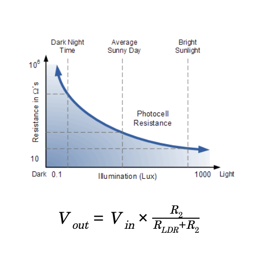
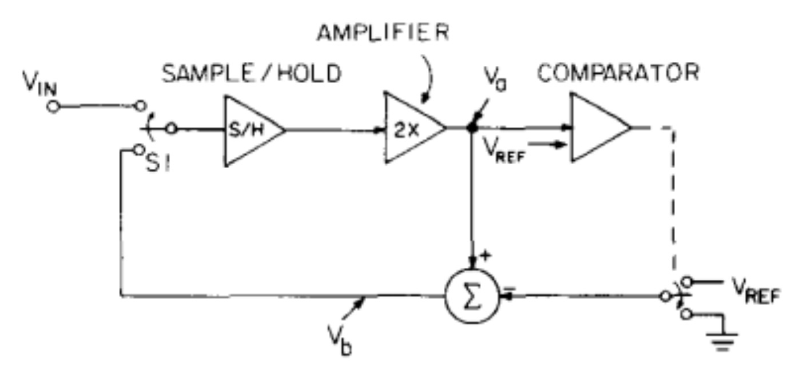

# Hand based Control

**Group AD**

**Yuneil Yeo, Yaqi Fan, Yujue Mao, Chirag Sachdeva, Rhea Upadhyay**

[Project Video](https://www.youtube.com/watch?v=Bn2jMuWJl88&feature=youtu.be)

[Project Progress Report](https://c-sachdeva.github.io/12740progress_report/)

[OpenChirp](https://openchirp.io/home/device/5da233d1466cc60c381e0c83)

## 1 Introduction

GesPress is the system that would control the computer application with the motion of the hand. GesPress is consisted of the software part (Python code) and the hardware part (including sensors, A/D convertor and Raspberry Pi). Hardware part would detect the presence of the hand and collect corresponding data. While software part would perform different reactions based on the signal detected from hand motion. For now, GesPress is able to control presentation slides and music players, including local player and online portals like YouTube. 

### 1.1 Motivation

To control the presentation, professors make the hand available for pressing buttons, touchpad, or remote device. Team AD thought of a touchless interface composed of Raspberry Pi and sensors for hand-free presentation control. The world has been revolving around the touchless interface today and creating hand-motion control for presentations during classes was just a minuscule part of the bigger idea. This study has focused the energies on solving real-time issues. GesPress can potentially be a part of the automated infrastructure systems and can improve the lifestyles of users. Therefore, the device can contribute to the ongoing research on cutting edge technologies.

### 1.2 Goals

- To design a model to unscramble hand motions into non-electrical signals (define the time and sequence of the hand motion).

- To transfer the non-electrical signals into electronic signals through Analog to Digital Converters (ADC).

- To porocess the digital data properly (eliminate noise, guarantee objectivity, utility, and integrity of the signals). 

- To expand the real-world application (be able to control the keyboard, do some basic operations like moving forward, backward and pause based on the hand motion detected).

- To create a stable and flexible environment for the sensors (make a box to avoid environmental interference).

### 2 Methodology

### 2.1 Phenomena of Interest

The concept behind the phenomena of interest for the project is to line the bridge between sensor measurement data and humane-characteristics on the basis of spatiotemporal proximity. The use of sensors in the project aids in using real-time data to manipulate analog outputs and channelize that into understanding user’s demands and following people-centric commands.

### 2.1.1 Physical Principle

Sensors are devices that can convert non-electrical signals to electrical signals either directly or via a number of steps (Fraden 2010). The project can be devised using various sensors. The physical principles of the three kinds of sensors that can be used have been described below:

- Thermoelectric- Thermoelectric sensors work on the principle of direct conversion of temperature differences to analog electrical voltage and vice versa in the thermocouple. example: Temperature Sensors (Stuijk 2019).
- Piezoelectric- This effect is based on the measurement of changes in pressure, acceleration , strain or force due to vibration by converting them into electrical signals. example: Accelerometers (Zheng et al 2019).
- Photosensitive- Light sensors sometimes use a component called a photodiode to measure illuminance. When beams of light strike a photodiode, they have a tendency to knock electrons loose, causing an electric current to flow. The brighter the light, the stronger the electric current. The current can then be measured to return the illuminance of the light ex: Light Sensors (Wai Li 1984).

### 2.1.2 Static and Dynamic Behavior

**Signal Characteristics:**

- Frequency: For the project, the signal is not oscillating in terms of time. There is no change in output when the hand is not moved. Therefore, the frequency of the signal depends on the number of times the hand movements are detected at certain time.

- Amplitude/Magnitude: Magnitude is the difference between the initial value and the measurement representing the hand presence. Amplitude is the maximum value of the magnitudes. 

**Sensor Characteristic - Static Behavior:**

- Input: Changes due to the hand movement

- Transfer Function: The relationship between the changes due to the input and the voltage output. The relationship can be linear or non-linear depending on the sensors.   

- Span: The range of input values are different for different sensors. It can be a binary range: No Change (0) to Change (1). It can be a dynamic range starting from the value representing the initial state to the value representing a change. 

- Accuracy: The accuracy is depended on the type of sensors used. The accuracy of the sensor is measured in terms of detecting the change in the movement.

- Hysteresis: If the relationship between the input and the output of the certain sensor is almost linear, the non-linearity error should be minimum (Fraden 2010).

- Saturation: The maximum operating range for a sensor should be defined inside a specific space that only the changes in the background are not detected.

- Repeatability: Under similar conditions, the error associated with the repeatability should be low enough so that the sensor should detect the hand movement every time. 

- Resolution: It should be small enough to detect the minute changes in hand movements. 
 
**Sensor Characteristic - Dynamic Behavior:**

- Frequency Response: It is the measure of output signal of a control system with respect to the changes due to the movement. The response is used to measure the dynamic response of a system. (Fraden 2010)                                
- Phase Shift : Phase Shift should be low enough to have a stable voltage response.  If the phase shift is too high, it reduces the phase marginal value of system and can result in unstable system response. (Fraden 2010)  
- Resonant frequency: It is the frequency at which sensors output signal increases considerably. The signals which behave linearly, first order systems do not resonate. (Fraden 2010). For the project, Resonant frequency differs with respect to the types of sensors.

### 2.2 Sensors used

 

Figure 1: Description of Photosensitive Light Sensor Module (MySensor 2019).

Photosensitive Light Sensor (LM393) works through the light dependent resistor (LDR). LDR is a semiconductor device that changes its electrical resistance depending on the presence of light, its resistance can reach several thousand Ohms in the dark, while only a few hundreds of Ohms in the light (MySensor 2019). According to Figure 1, when ambient light intensity does not reach the threshold value, the module DO port output high; when the ambient light intensity exceeds a set threshold, the D0 output low; digital outputs D0 can be directly connected with the microcontroller through the microcontroller to detect high and low, thereby detecting the light intensity changes in the environment. 

The specification of Photosensitive Light Sensor (LM393) is extracted as below,

- Input Voltage: 3~5V  (MySensor 2019).
- Output: Analog Voltage Form or Digital Switching Form  (MySensor 2019).
- Sensitivity: Adjustable for visible light  (MySensor 2019).

Connecting LDR in series with a standard resistor could generate a voltage drop based on light intensity, and the circuit is called voltage divider network. Figure 3 shows the voltage divider network. 

 

Figure 2: Voltage Divider Network (Electronics Tutorials 2019). 

As shown in Figure 2, the amount of voltage drop across R2 is determined by the resistance of LDR. The voltage present at the junction is determined by the formula shown in Figure 2.

**Sensor characteristics:**

- Input: As the hand movement is detected by light sensors, the input value(i.e. light intensity) changes. The frequency of input signal changes as compared to the original light source. 

- Transfer Function:  The relationship between the changes due to the input and the voltage output. For light sensors that this project uses, the transfer function can be defined by the following equation:

 

Figure 3: Transfer Function (Electronics Tutorials 2019).

Graph on Figure 3 shows that the resistance of LDR increases when illumination (LUX) value is low.  The increase in LUX value decreases the resistance of LDR. (Nagadevi 2018).

- Span: The range of input values for light sensors is dynamic starting from the value representing the initial state to the value representing the change in light intensity. Since LDR is used on LM393, the range of light levels selected for LDR is researched. For ADC, the selected range of light levels is 200 LUX to 30 LUX (Kruger 2017). 

- Accuracy: The accuracy is depended on the type of sensors. The accuracy was measured by an experiment. Out of 20 times, a hand movement was performed in the span of the sensor, 16 times it was detected correctly. The percentage accuracy is ~80%.

- Resolution: The resolution of LM393 or LDR is ± 35 lux (Kruger 2017). 

### 2.3 Signal Conditioning and Processing

Signal Processing is the process of acquiring data with enhanced accuracy, it is performed with the help signal conditioner. This conditioner helps to provide the user with accurate and precise measurements and enhanced machine control. For this project, we have used A/D converter as a signal conditioner. The signal conditioner has been designed to perform several functions listed below:
 
- Signal Conversion: The main function of signal conditioners is to convert the raw signal from sensors to high level electrical signals. If several sensors are being used in a device, the conditioners need to be connected to each other as well (Das A 2019).
- Linearisation: If the output-stimulus relation for a sensor signal is not linear, conditioners can perform functions to convert the outputs in a linear range of values. This will provide a smooth curve for output signals and increase accuracy (Das A 2019).
- Amplifying: Two methods can be employed to amplify the signals, increasing the measured input values of signals or by increasing the signal to noise ratio. Different types of instrumentation sensors and isolation sensors can be used with high impedance characteristics to amplify the measured output values (Das A 2019).
- Filtering: The final signal output values can be filtered to only include a spectrum of frequencies for analysis. Conditioners can be made from with active or passive components or digital algorithms. The passive filters use capacitors or resistors with the maximum signal gain. The active filters ise operational amplifiers or transistors. The advanced signal conditioners use digital filters without any requirement of hardware (Das A 2019).

               
This project makes use of an Analog to Digital Converter(MCP3008) for signal processing and conditioning with 8 channels and 10 Bits precision. The below figure shows the numbering of the pins on MCP3008 looks. 

 

Figure 4: MCP3008 (Berges and Chen 2019).

The working of ADC has been explained below:

 

Figure 5: ADC Block Diagram (Wai Li 1984).

The block diagram describes the broad working of an ADC. It performs two functions, sampling and holding, quantisation and processing of the digital output. The quantisation process can either be performed by analog integration, digital counter and successive approximation or direct conversion in Flash types (Wai Li 1984). Further, the digital output data is served to the CPU or gets directly stored in memory. In the output of S/H, certain voltage is present. A numerical value is assigned to the voltage in correspondence with its amplitude (Wai Li 1984). It is in the limited range of possible values given by power of 2 i.e 2^n (28 = 256, 210=1024 etc). Once closest value is assigned it is encoded in the form of binary numbers generated by the quantizer, that are represented by ‘n’ bits (Wai Li 1984). Post this the digital signal is again converted to analog output for the user to interpret the frequency response and record sensor measurements. The choice of integrating the ADC with MCU chip or another stand alone Integrated chip is subject to change as the interface demands (Wai Li 1984).     

### 2.3.1 Code Description

To process the hand motion signals,  a short series list of data samples, which can refresh itself continuously after its store is full or for some certain demand, is created. The length of the series is defined as the operation time range for single hand motion.  
In this way, the sequence of hand presence information can be recorded on the list and processed.

The first voltage analog output representing the light intensity value of the environment is stored as an initial value with an assumption that hand is not blocking the light. Then, the difference between the initial value and the measurement is calculated.

After the difference is measured, the filtration of the data proceeds. It is possible that the brightness of the surrounding environment can be changed due to external factors. The small changes in the brightness of the surrounding environment due to the external factors are considered as the noise. Therefore, the code checks the difference between the initial value and the measurement. If the value of the difference is less than the certain arbitrary number, the code determines that the difference is due to the external factor, eliminate the value, and append zero to the list. If the difference is bigger than the certain arbitrary number, the difference is appended to the list. 
The overall list can give the information of the time length and specific time of hand covering the light sensor. With two light sensors settling separately on the left and right side, there are two lists of data providing information about the sequence of hand covering two sensors. Therefore, a simple instruction based on the hand motion can be executed by this interpreting process. Similarly, there will be more information input with more sensors, and thus more complex motions and executions.

### 3.Experiments and Results

**Experiment 1: Experiments with One Sensor** <a href="https://github.com/yujuem/12740project.github.io/blob/master/EXP1.pdf" target="_blank">Experiment 1</a>

Experiment is conducted to test the photosensitive light sensors in order to implement hand-gesture based control for the project. Initially the team tested only one sensor to check the analog output and the sensor sensitivity. This was done to make sure that the light sensors could successfully capture the hand gesture. One photosensitive light sensor was connected to the Raspberry Pi. On moving our hand above the sensor, the light detected by the sensor is reduced. This corresponded to a jump in the voltage. 

**Experiment 2: Experiments with Two Sensors** <a href="https://github.com/yujuem/12740project.github.io/blob/master/EXP2.pdf" target="_blank">Experiment 2</a>

To detect a hand motion (gesture), more than one sensor is required. After the first experiment, the team added another photosensitive light sensor to the circuit. Simultaneous readings from two sensors is used to detect hand motion from right to left or left to right direction. Additionally, the setup was enclosed in a box to reduce the influence of ambient lighting on the sensors and minimise noise from ambient atmosphere (vibrations, wind, heat etc.).

**Experiment 3: Analog output I** <a href="https://github.com/yujuem/12740project.github.io/blob/master/Exp3.pdf" target="_blank">Experiment 3</a>  <a href="https://github.com/yujuem/12740project.github.io/blob/master/Code%20EXP%203.pdf">Code</a>

Experiment is conducted to make the system to detect the hand motion successfully. Two light sensors, Raspberry Pi, A/D converter, and python code are used to create the system. The difference in the analog voltage output values between the initial value and measurement is appended to the list of sensor. List has fixed length of three. Hand motion is detected in the code by comparing the first and last value of both lists.The system is not detecting the hand motion properly, and the modification of the code is needed. 

**Experiment 4: Analog output II** <a href="https://github.com/yujuem/12740project.github.io/blob/master/EXP4.pdf" target="_blank">Experiment 4</a>  <a href="https://github.com/yujuem/12740project.github.io/blob/master/Code%20EXP%204.pdf">Code</a>

Experiment is conducted modify the code used in Experiment 3 to detect the hand motion successfully. Method and Procedure are similar to Experiment 3. Unlike Experiment 3, the list does not have fixed length but have maximum length defined by time.sleep value and maximum time of hand motion. The system detects the hand motion correctly except when the hand moves quickly. 

**Experiment 5: Presentation Control** <a href="https://github.com/yujuem/12740project.github.io/blob/master/EXP5.pdf" target="_blank">Experiment 5</a>  <a href="https://github.com/yujuem/12740project.github.io/blob/master/Code%20EXP%205.pdf">Code</a>

Experiment is conducted to control the presentation with slightly modified code created in Experiment 4. Library pynput is imported to press and release the key for each hand motion. Left to right motion forwards the presentation while right to left motion backwards the presentation. Presentation slides are controlled with a hand motion successfully except when the hand moves quickly. 

**Experiment 6: Music Control** <a href="https://github.com/yujuem/12740project.github.io/blob/master/EXP6.pdf" target="_blank">Experiment 6</a>  <a href="https://github.com/yujuem/12740project.github.io/blob/master/Code%20EXP%206.pdf">Code</a>

Experiment is conducted to control the music. The system also detects the long placement of hand on each sensor and both sensors. The long placement of hand on left sensor, right sensor, and both sensors make the system to forward the music, rewind the music, and resume/pause the music. Music is controlled with a hand motion successfully except when the hand moves quickly. 

**Experiment 7: Construction of the Device Box** <a href="https://github.com/yujuem/12740project.github.io/blob/master/EXP7.pdf" target="_blank">Experiment 7</a>

The requirements for the box are:

  - It should be compact. It should be easy to disintegrate and assemble back
  - Provide structural support to the circuit 
  - Non conducting and thermally insulating 
  - Have opening for the sensor

To meet these requirements, the box consists of two compartments that can be easily disintegrated. The top compartment houses the entire circuit and the sensors are attached to the bottom part of the top panel. This ensures protection from ambient environment. Moreover, the box is made up of wood to prevent thermal and electric conduction.

**Design**

 
Figure 6. the design of device

**OpenChrip**

Figure 7 shows the interface of the OpenChirp for our data series.

 
Figure 7. the Openchirp Interface

At first, A voltage jump in left sensor is detected and then a few seconds later it went back to normal while there was another voltage jump in right sensor. This implies there was a hand over the left sensor blocking the light first and in a few seconds it moved to the right one. Therefore, this part is a hand motion of left to right. Similarly, it is applied to the right part.

### 4.Discussion

**What we gain from the project?**

In this project, Team AD implemented the hand movement control of slides and music player by using light sensors, A/D converter, and Raspberry Pi. Team AD also uploaded our real-time data to the OpenChrip in order to create the IoT device. With the completion of the project, Team AD get a deeper understanding of (1) the principles of various sensors, (2) the circuits analysis, (3) Linux commands and Python programming, (4) A/D conversions and signal processing.

**What can we do in the future?**

For now, the device still has some places can be improved. (1) Firstly, certain intervals are required for each movement. The sensor needs a certain period of time to initialize once it fails to detect a movement or just finish the previous detection, which sometimes results in a lack of smooth operation. (2) Secondly, the device only contains two light sensors, so we can’t enable more complex movement control. With two sensors, we could detect five types of movement at most (left-to-right, right-to-left, left-dark, right-dark, both dark). If more sensors are included in the device, we is able to explore more complex movements. However, the extraction and combination of signals will also become more difficult.

### 5.Reference
Berges, M., and Chen, B. (2019). “3. Reading Analog Signals with an ADC”. 12-740 Data Acquisition. <https://inferlab.github.io/12740/tutorials/adc.html>. (Accessed 17 October 2019).

Das A. (2020). “Preview and Introduction. In: Signal Conditioning. Signals and Communication Technology.” Springer. (Accessed 17 October 2019). 

Electronics Tutorials. (2019). “Light Sensors.” Electronics Tutorials. < https://www.electronics-tutorials.ws/io/io_4.html>. (Accessed 17 October 2019).
 
Fraden, J. (2010). “Handbook of Modern Sensors: Physics, Designs, and Applications: Chapter 2 - Sensor Characteristics” Springer. (Accessed 17 October 2019).

Haugan, H. (2008). “Study of residual background carriers in midinfrared InAs/GaSb superlattices for uncooled detector operation.” Applied Physics Letters. <https://www.researchgate.net/publication/252286636_Study_of_residual_background
carriers_in_midinfrared_InAsGaSb_superlattices_for_uncooled_detector_operation>. (Accessed 17 October 2019).
 
Kruger, C. (2017). “Smart street lights using power line communication.” IEEE. < https://ieeexplore.ieee.org/abstract/document/8095718>. (Accessed 17 October 2019).
 
MySensors. (2019). “Light Level Sensor – LM393.” MySensors. <https://www.mysensors.org/build/light-lm393>. (Accessed 17 October 2019).
 
Nagadevi, S. (2018). “IoT BASED POLYHOUSE MONITORING AND CONTROL SYSTEM.” International Journal of Pure and Applied Mathematics. < https://acadpubl.eu/hub/2018-118-21/articles/21e/64.pdf>. (Accessed 17 October 2019).
 
Stuijk, S. (2019). “Sensors and Actuators: Sensors Physics.” Technische Universiteit Eindhoven University of Technology. < http://www.es.ele.tue.nl/education/SensorsActuators/files/sensors/physics/05-thermoelectric-effect.pdf>.  (Accessed 17 October 2019).
 
Wai Li, P. (1984). “A Ratio-Independent Algorithmic Analog-to-Digital Conversion Technique.” IEEE. < https://www.researchgate.net/profile/Paul_Gray10/publication/2981427_A_Ratio-Independent_Algorithmic_Analog-to-Digital_Conversion_Technique/links/567b0fb908ae1e63f1df8713.pdf>. (Accessed 17 October 2019).
