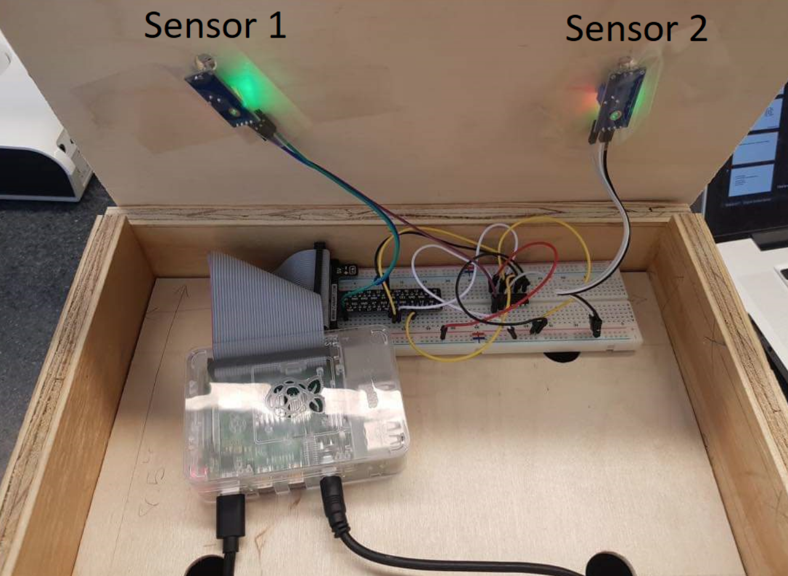
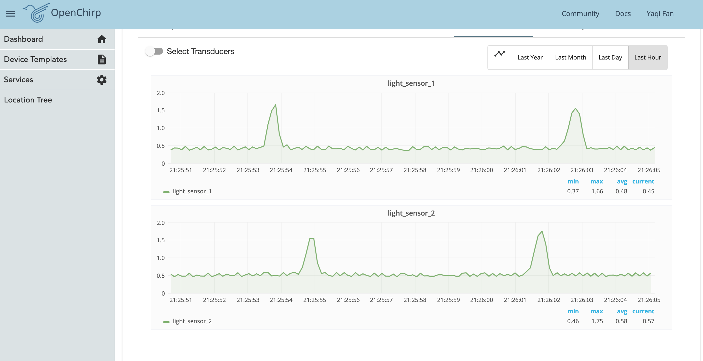
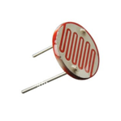
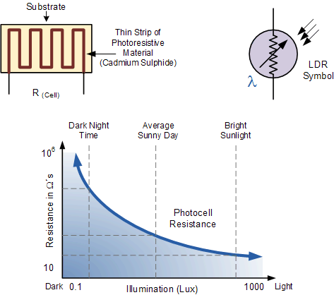
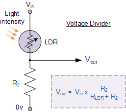
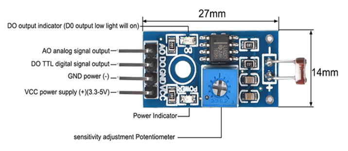
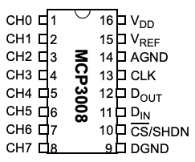
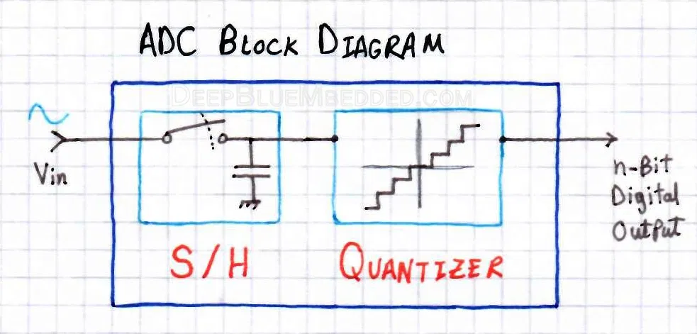
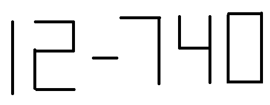

# Hand based Control

**Group AD**

**Yuneil Yeo, Yaqi Fan, Yujue Mao, Chirag Sachdeva, Rhea Upadhyay**

[Project Video](https://www.youtube.com/watch?v=Bn2jMuWJl88&feature=youtu.be)

[Project Progress Report](https://c-sachdeva.github.io/12740progress_report/)

[Project Experiments]()

[OpenChirp](https://openchirp.io/home/device/5da233d1466cc60c381e0c83)

## 1 Introduction

### 1.1 Motivation
To control the presentation, professors make the hand available for pressing buttons, touchpad, or remote device. Team AD thought of a touchless interface composed of Raspberry Pi and sensors for hand-free presentation control. The world has been revolving around the touchless interface today and creating hand-motion control for presentations during classes was just a minuscule part of the bigger idea. This study has focused the energies on solving real-time issues. GesPress can potentially be a part of the automated infrastructure systems and can improve the lifestyles of users. Therefore, the device can contribute to the ongoing research on cutting edge technologies.

### 1.2 Goals

- To design a model to unscramble hand motions into non-electrical signals (define the time and sequence of the hand motion).

- To transfer the non-electrical signals into electronic signals through Analog to Digital Converters (ADC).

- To porocess the digital data properly (eliminate noise, guarantee objectivity, utility, and integrity of the signals). 

- To expand the real-world application (be able to control the keyboard, do some basic operations like moving forward, backward and pause based on the hand motion detected).

- To create a stable and flexible environment for the sensors (make a box to avoid environmental interference).

### 1.3 Our Works

GesPress is the system that would control the computer application with the motion of the hand. GesPress is consisted of the software part (Python code) and the hardware part (including sensors, A/D convertor and Raspberry Pi). Hardware part would detect the presence of the hand and collect corresponding data. While software part would perform different reactions based on the signal detected from hand motion. For now, GesPress is able to control presentation slides and music players, including local player and online portals like YouTube. 

**Our Design**

 
Figure 1. the design of device

**OpenChrip**
Figure 2 shows the interface of the OpenChirp for our data series.

 
Figure 2. the Openchirp Interface

At first, A voltage jump in left sensor is detected and then a few seconds later it went back to normal while there was another voltage jump in right sensor. This implies there was a hand over the left sensor blocking the light first and in a few seconds it moved to the right one. Therefore, this part is a hand motion of left to right. Similarly, it is applied to the right part.

### 2 Methodology
### 2.1 
### 2.2 Sensor used

Photosensitive Light Sensor (LM393) works through the light dependent resistor (LDR). LDR is a semiconductor device that changes its electrical resistance depending on the presence of light, its resistance can reach several thousand Ohms in the dark, while only few hundreds of Ohms in the light. Below figure shows the variation of the resistance of LDR. 

Figure 2 shows that the resistance of LDR increases when illumination (LUX) value is low. The increase in LUX value decreases the resistance of LDR. 

Compared to other alternative light sensing technologies like Photodiode, Phototransistor, LDR has a lower sensitivity. However, it is more reliable for outdoor environment. It can be easily controlled by visible light, because of its similar spectral response curve to that of the human eye.

Connecting LDR in series with a standard resistor could generate a voltage drop based on light intensity, and the circuit is called voltage divider network. Figure 3 shows the voltage divider network. 

The specification of Photosensitive Light Sensor (LM393) is extracted as below,

- Input Voltage: 3~5V

- Output: Analog Voltage Form or Digital Switching Form

- Sensitivity: Adjustable for visible light

 
Figure 1: LDR.

 
Figure 2: The variation of resistance of LDR.

 
Figure 3: Voltage Divider Network 

 
Figure 4: Description of Photosensitive Light Sensor Module

 
Figure 5: MCP3008(Berges and Chen 2019).

 
Figure 6: ADC Block Diagram

 
Figure 6: Sample Output

### 3.Experiments and Results

**Experiment 1: Experiments with One Sensor** <a href="yujuem/12740project.github.io/EXP1.pdf" target="_blank">Experiment 1</a>

Experiment is conducted to test the photosensitive light sensors in order to implement hand-gesture based control for the project. Initially the team tested only one sensor to check the analog output and the sensor sensitivity. This was done to make sure that the light sensors could successfully capture the hand gesture. One photosensitive light sensor was connected to the Raspberry Pi. On moving our hand above the sensor, the light detected by the sensor is reduced. This corresponded to a jump in the voltage. 

**Experiment 2: Experiments with Two Sensors**

To detect a hand motion (gesture), more than one sensor is required. After the first experiment, the team added another photosensitive light sensor to the circuit. Simultaneous readings from two sensors is used to detect hand motion from right to left or left to right direction. Additionally, the setup was enclosed in a box to reduce the influence of ambient lighting on the sensors and minimise noise from ambient atmosphere (vibrations, wind, heat etc.).

**Experiment 3: Analog output I**

Experiment is conducted to make the system to detect the hand motion successfully. Two light sensors, Raspberry Pi, A/D converter, and python code are used to create the system. The difference in the analog voltage output values between the initial value and measurement is appended to the list of sensor. List has fixed length of three. Hand motion is detected in the code by comparing the first and last value of both lists.The system is not detecting the hand motion properly, and the modification of the code is needed. 

**Experiment 4: Analog output II**

Experiment is conducted modify the code used in Experiment 3 to detect the hand motion successfully. Method and Procedure are similar to Experiment 3. Unlike Experiment 3, the list does not have fixed length but have maximum length defined by time.sleep value and maximum time of hand motion. The system detects the hand motion correctly except when the hand moves quickly. 

**Experiment 5: Presentation Control**

Experiment is conducted to control the presentation with slightly modified code created in Experiment 4. Library pynput is imported to press and release the key for each hand motion. Left to right motion forwards the presentation while right to left motion backwards the presentation. Presentation slides are controlled with a hand motion successfully except when the hand moves quickly. 

**Experiment 6: Music Control**

Experiment is conducted to control the music. The system also detects the long placement of hand on each sensor and both sensors. The long placement of hand on left sensor, right sensor, and both sensors make the system to forward the music, rewind the music, and resume/pause the music. Music is controlled with a hand motion successfully except when the hand moves quickly. 

**Experiment 7: Construction of the Device Box**

The requirements for the box are:

  - It should be compact. It should be easy to disintegrate and assemble back
  
  - Provide structural support to the circuit 
  
  - Non conducting and thermally insulating 
  
  - Have opening for the sensor

To meet these requirements, the box consists of two compartments that can be easily disintegrated. The top compartment houses the entire circuit and the sensors are attached to the bottom part of the top panel. This ensures protection from ambient environment. Moreover, the box is made up of wood to prevent thermal and electric conduction.

### 4.Discussion

**What we gain from the project?**

We implemented the hand movement control of slides and music player by using light sensors, A/D convertor and Raspberry Pi. We also uploaded our real-time data to the OpenChrip in order to create the IoT device. With the completion of the project, we get a deeper understanding of (1) the principles of various sensors, (2) the circuits analysis, (3) Linux commands and Python programing, (4) A/D conversions and signal processing.

**What can we do in the future?**

For now, the device still has some places can be improved. (1) Firstly, certain intervals are required for each movement. The sensor needs a certain period of time to initialize once it fails to detect a movement or just finish the previous detection, which sometimes results in a lack of smooth operation. (2) Secondly, the device only contains two light sensors, so we can’t enable more complex movement control. With two sensors, we could detect five types of movement at most (left-to-right, right-to-left, left-dark, right-dark, both dark). If more sensors are included in the device, we is able to explore more complex movements. However, the extraction and combination of signals will also become more difficult.

### 5.Reference
